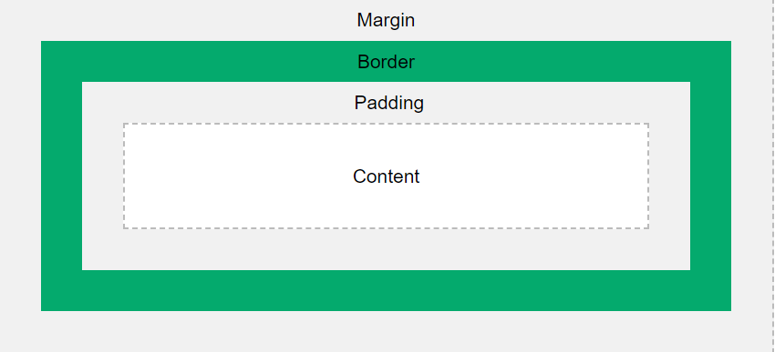

<!-- START doctoc generated TOC please keep comment here to allow auto update -->
<!-- DON'T EDIT THIS SECTION, INSTEAD RE-RUN doctoc TO UPDATE -->

**Table of Contents**

- [CSS BOX MODEL](#css-box-model)
  - [Properties](#properties)
    - [1.Content](#1content)
    - [2.Padding](#2padding)
    - [3.Border](#3border)
    - [4.Margin](#4margin)
  - [Example of a css box model](#example-of-a-css-box-model)
  - [An image of a css box model](#an-image-of-a-css-box-model)

<!-- END doctoc generated TOC please keep comment here to allow auto update -->

# CSS BOX MODEL

The CSS box model is a container that contains multiple properties including borders, margin, padding, and the content itself.

It is used to create the design and layout of web pages.

According to the CSS box model, the web browser supplies each element as a square prism.

## Properties

### 1.Content

The content area consists of content like image, text, or other forms of media content. The height and width properties help to modify the box dimensions.

### 2.Padding

The padding area is the space around the content area and within the border-box. It can be applied to all sides of the box or to the specific, selected side(s) - top, right, bottom, and/or left.

### 3.Border

The border area surrounds the padding and the content, and can be applied to all the sides of the box or to selected side(s) - top, right, bottom, and/or left.

### 4.Margin

The margin area consists of space between the border and the margin. The margin does not possess its own background color and is completely transparent. It shows the background color of the element, like the body element.

## Example of a css box model

```css
div {
  width: 300px;
  border: 15px solid green;
  padding: 50px;
  margin: 20px;
}
```

## An image of a css box model



**Note:** The margin property also affects the total space that the box will take up on the page, but the margin is not included in the actual size of the box. The box's total width and height stops at the border.
